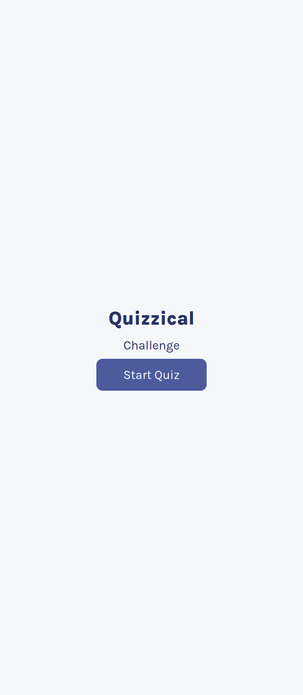
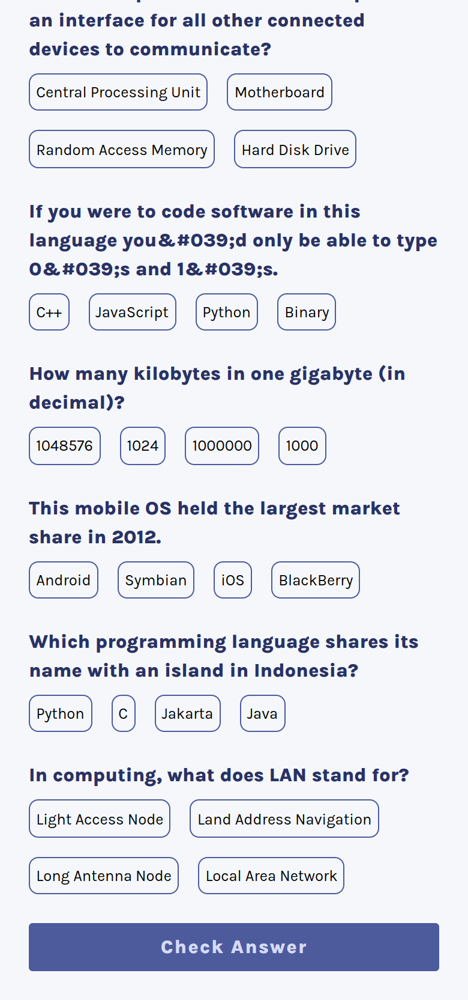
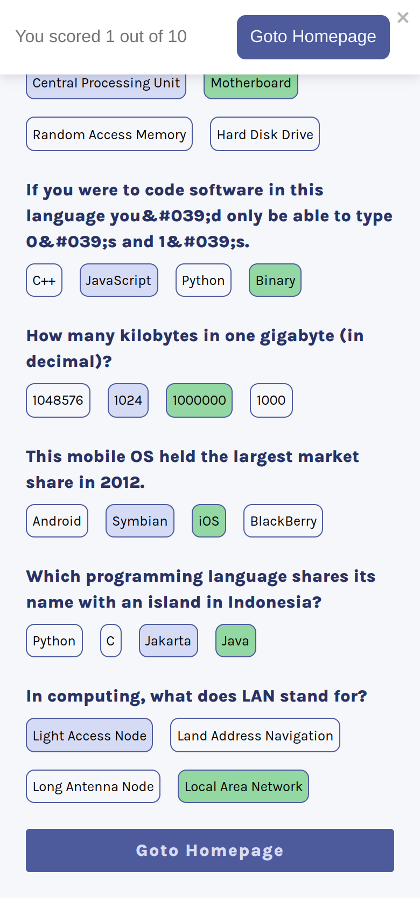

# Project Title

A Quiz App built using React, React Query and Sass.


## Run Locally

Clone the project

```bash
  git clone https://github.com/ayequill/quizical.git
```

Go to the project directory

```bash
  cd quizical
```

Install dependencies

```bash
  npm install
```

Start the server

```bash
  npm run dev
```


## API Reference

### The Open Trivia Database API
## Screenshots


 


